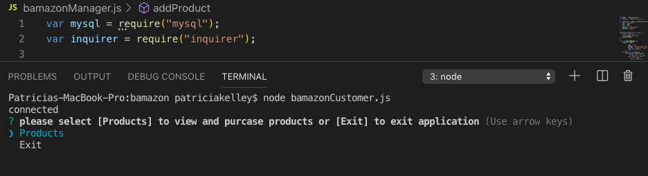

<h1>Bamazon</h1>
<h3>Bamazon is a Node application that runs accross two different js files</h3>
<ul>
<li>bamazonCustomer</li>
<li>bamazonManager</li>
</ul>
<h3>Bamazon Customer View</h3>
<ul>
<li>The Bamazon Customer view will allow users to view all of the items for sale.</li>
<li>The user can then purchase items based on each item's specific Product ID and how many of each item to purchase</li>
<li>When the user purchases items, the built in calculator provides a total cost for the order and then the ordered items are removed from the inventory for the next order</li>
<h2>Customer Screenshots</h2>

